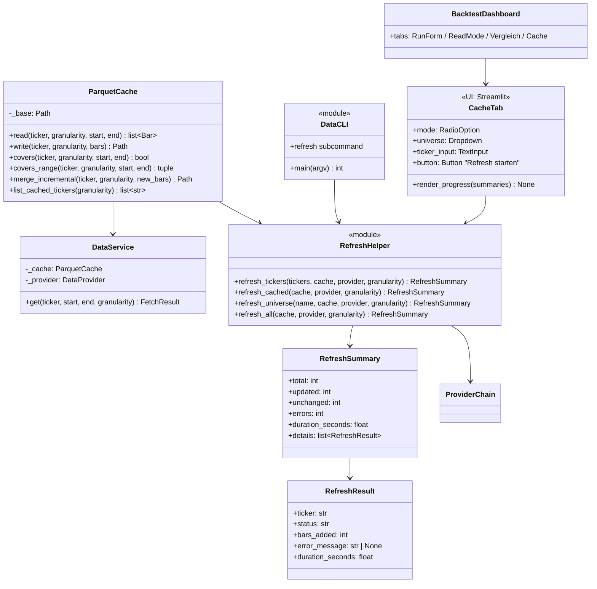
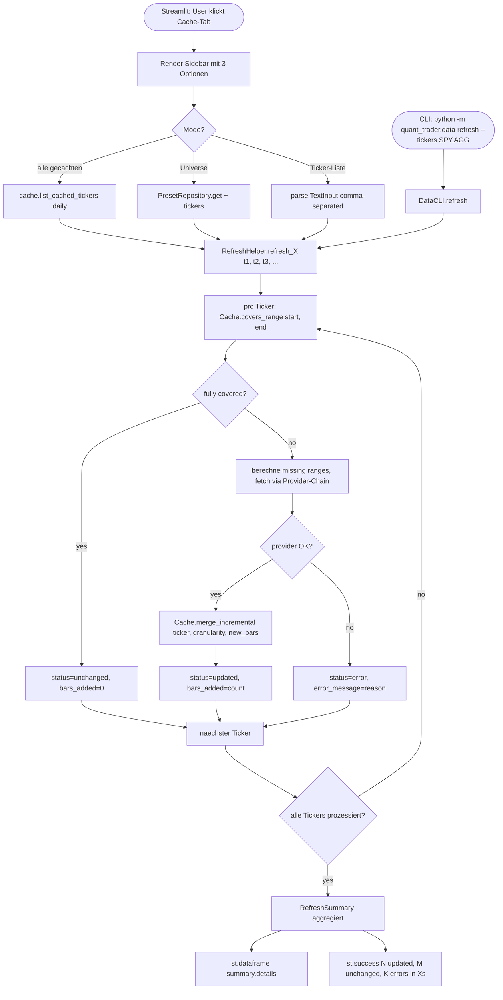
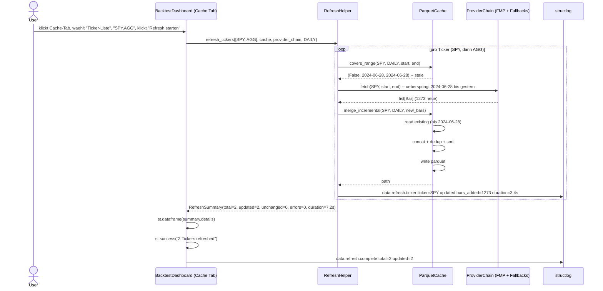

# UML: Slice 1.6 - Cache Refresh (Bulk + Inkrementell + UI)

Status:    APPROVED
Phase:     P1 Datenlayer (Erweiterung)
Slice:     1.6 Cache Refresh
Approved:  2026-07-15

Mapped Requirements:
- NFR-Data-1: Inkrement-Update (kein Full-Refetch bei Overlap) - jetzt vollstaendig
- NFR-Perf-2: <60s fuer 5y Cache-Miss (pro Ticker)
- NFR-Ux-1: Deutsche UI-Texte im Dashboard
- NFR-Obs-1: Strukturiertes Logging (data.refresh.*, cache.merge_incremental)

Stories:
- US-P1.8: Inkrement-Update: nur fehlende Bars nachladen
- US-P1.9: Cache-Refresh-Button im Streamlit Dashboard

Erweitert Slice 1.2 (Parquet-Cache) und Slice 3.5 (Dashboard) um
einen Refresh-Mechanismus. Bestehende Provider-Chain (FMP -> YFinance
-> StockData -> AlphaVantage) aus ADR-0009 wird wiederverwendet.

## Structure

## Flow

## Sequence

## Notes

- **Inkrement-Update**: `merge_incremental` macht full rewrite mit DEDUP;
  NICHT echtes append (parquet hat kein effizientes append), aber
  für tägliche Updates (1 Bar/Tag) ist die Full-Rewrite-Groesse minimal
- **Cache-Hit-Erkennung**: `covers_range` liefert `(fully_covered, min, max)`;
  wenn `start >= min AND end <= max`: kein Fetch noetig (NFR-Perf-2)
- **Error-Handling**: pro Ticker isoliert; ein fehlgeschlagener Ticker
  blockiert die anderen nicht (try/except um die Ticker-Schleife)
- **Performance**: FMP Free-Tier (250 calls/Tag) erlaubt ~250 Tickers
  Refresh pro Tag
- **UI-Pattern**: `st.tabs([...])` mit neuem Tab "Cache", analog zu Slice 3.5 Pattern
- **Backward-Compat**: `provider.fetch()` und `cache.write()` unveraendert,
  neue Methoden als Add-On
- **Dashboard**: nutzt `RefreshHelper` direkt (kein separater Background-Task)
