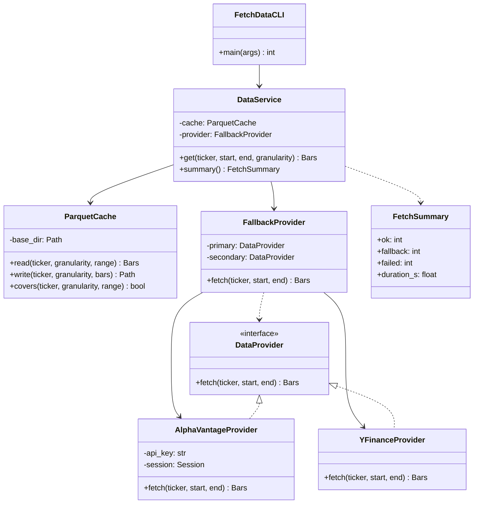
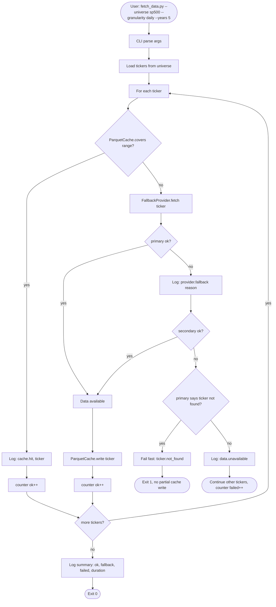
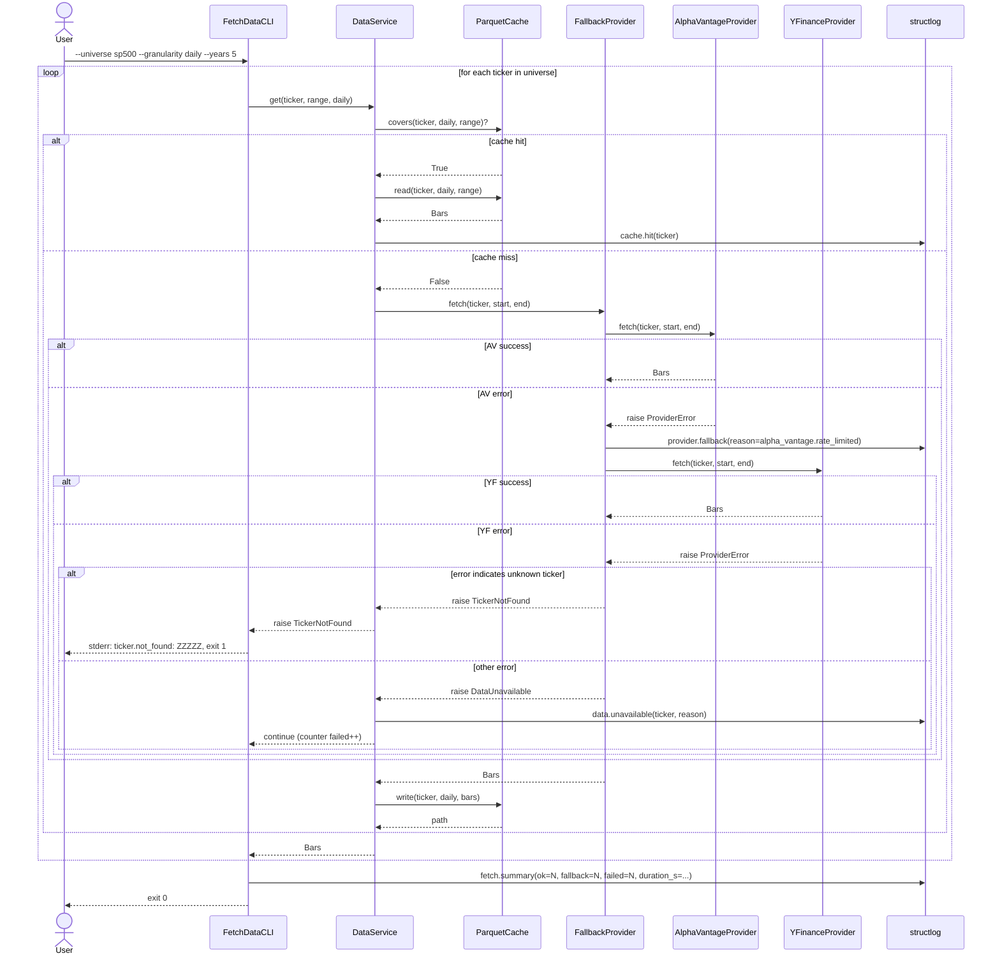

# UML: Slice 1.2 - DataProvider + Cache

Status:    DRAFT
Phase:     P1 Datenlayer
Slice:     1.2 DataProvider + Cache
Approved:  -

Mapped Requirements:
- NFR-Rel-1: Daten-Fetch idempotent
- NFR-Perf-2: Daten-Fetch fuer ein Ticker 5 Jahre < 60 s
- NFR-Data-1: Parquet-Cache mit Inkrement-Update (Out-of-Scope hier: kein Auto-Refresh)
- NFR-Obs-1: Strukturiertes Logging (JSON)
- NFR-Ux-1: CLI-Texte deutsch, klare Fehlermeldungen

Stories:
- US-P1.2: Historische Tagessdaten fuer eine Liste laden
- US-P1.3: Cache schlaegt zu, kein Reload
- US-P1.4: Automatischer Fallback bei Provider-Fehler
- US-P1.6: Klare Fehlermeldung bei ungueltigem Ticker

## Structure

## Flow

## Sequence

