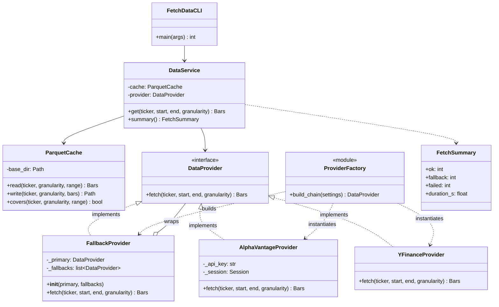
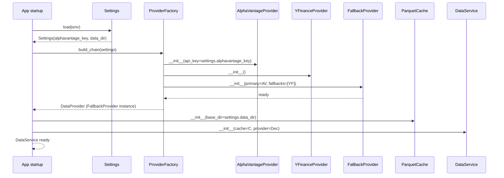
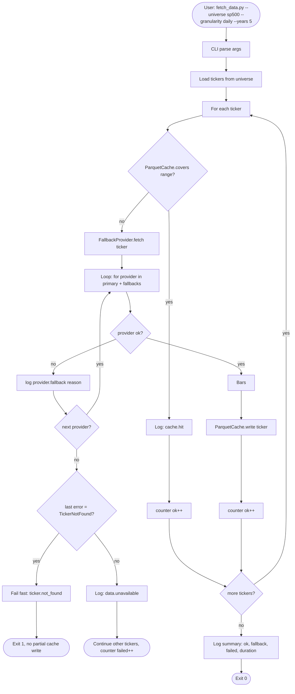
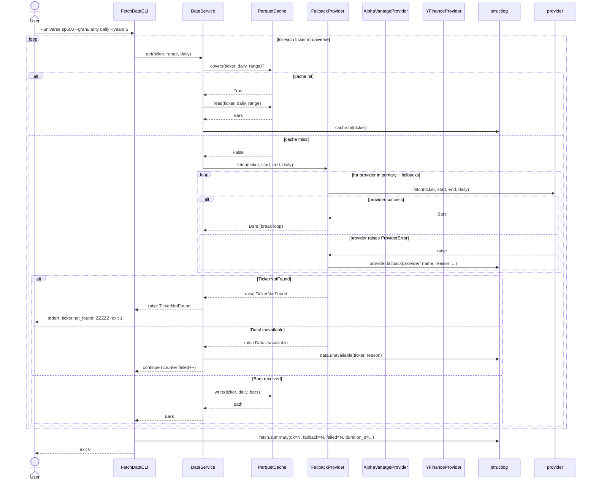

# UML: Slice 1.2 - DataProvider + Cache

Status:    APPROVED
Phase:     P1 Datenlayer
Slice:     1.2 DataProvider + Cache
Approved:  2026-07-08

Mapped Requirements:
- NFR-Rel-1: Daten-Fetch idempotent
- NFR-Perf-2: Daten-Fetch fuer ein Ticker 5 Jahre < 60 s
- NFR-Data-1: Parquet-Cache mit Inkrement-Update (Out-of-Scope hier: kein Auto-Refresh)
- NFR-Obs-1: Strukturiertes Logging (JSON)
- NFR-Ux-1: CLI-Texte deutsch, klare Fehlermeldungen

Stories:
- US-P1.2: Historische Tagessdaten fuer eine Liste laden
- US-P1.3: Cache schlaegt zu, kein Reload
- US-P1.4: Automatischer Fallback bei Provider-Fehler
- US-P1.6: Klare Fehlermeldung bei ungueltigem Ticker

## Structure

Hinweis zur Beziehung: `FallbackProvider o-- DataProvider` ist Aggregation
(offene Raute). Der Decorator haelt eine Referenz auf einen DataProvider,
besitzt ihn aber nicht. Eine zweite Aggregation an die Liste ist ueber die
Multiplizitaet `fallbacks: list~DataProvider~` ausgedrueckt.

## Provider-Setup

Der Factory (`quant_trader.data.factory`) ist die einzige Stelle, an der die
Provider-Instanzen erzeugt werden. Hinzufuegen eines weiteren Anbieters
(z.B. Polygon spaeter) erfordert nur eine Aenderung in `ProviderFactory`,
nicht in `DataService` oder `FallbackProvider`.

## Flow

## Sequence

