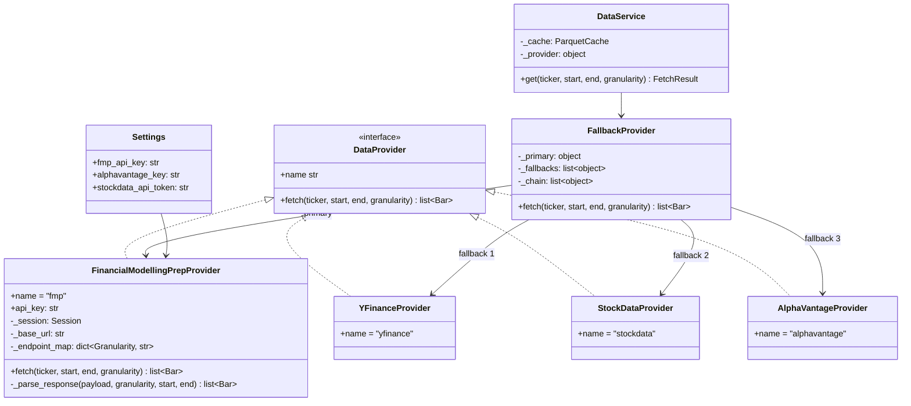
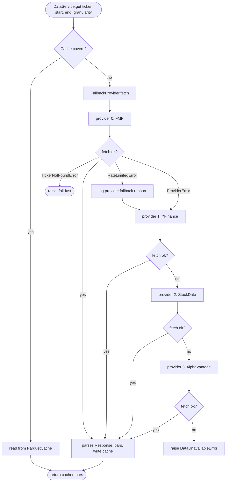
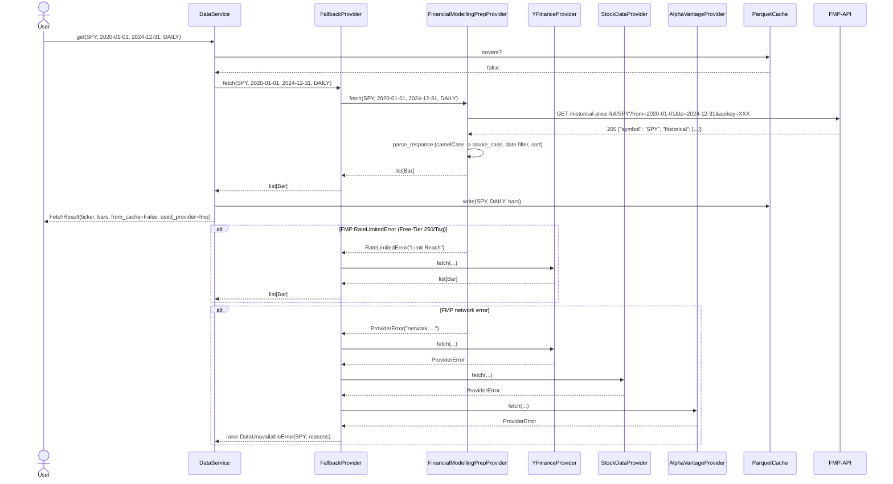

# UML: Slice 1.5 - Financial Modelling Prep (FMP) Provider

Status:    APPROVED
Phase:     P1 Datenlayer
Slice:     1.5 FMP-Provider
Approved:  2026-07-14

Mapped Requirements:
- NFR-Data-3: FMP als Primary Provider (Free-Tier 250 calls/Tag) - DRAFT -> APPROVED
- NFR-Sec-1: API-Key via .env, niemals im Repo
- NFR-Rel-1: Daten-Fetch idempotent (via DataService-Cache)
- NFR-Perf-2: Daten-Fetch fuer ein Ticker 5 Jahre < 60s

Stories:
- keine neue User-Story (NFR-getriebener Provider-Slice, dokumentiert in ADR-0009)

Erweitert die bestehende Provider-Chain (ADR-0001) um FMP als neuen
Primary. Bestehende Klassen `DataProvider` Protocol, `FallbackProvider`,
`DataService` und `ParquetCache` werden wiederverwendet.

## Structure

## Flow

## Sequence

## Notes

- `FinancialModellingPrepProvider` wirft `RateLimitedError` bei
  `Limit Reach` (HTTP 200 mit `Error Message`); `FallbackProvider`
  schaltet automatisch weiter.
- `TickerNotFoundError` schlaegt sofort durch (fail-fast) - gilt fuer
  alle Provider in der Kette.
- `FinancialModellingPrepProvider.fetch` liest `settings.fmp_api_key`
  via Dependency Injection im Factory (`build_chain(settings)`).
- Wenn `fmp_api_key` leer: Provider wird erzeugt, wirft aber bei
  erstem Fetch `ProviderError("FINANCIAL_MODELLING_PREP_KEY not set")`,
  was den Fallback triggert.
