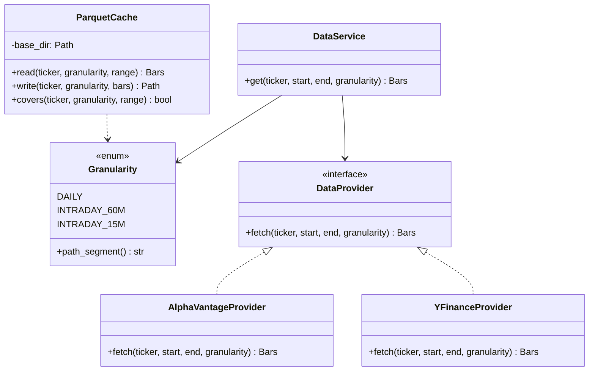
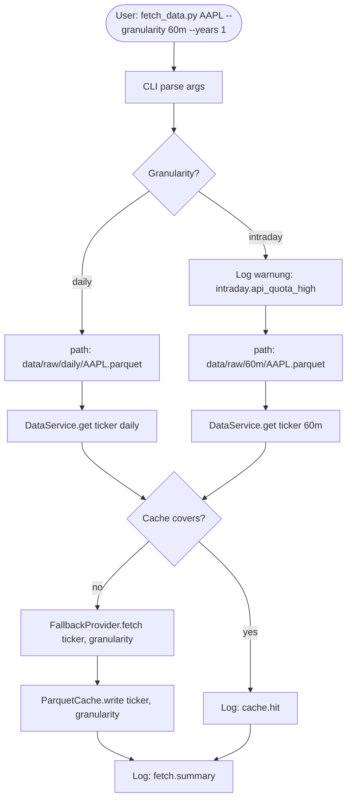
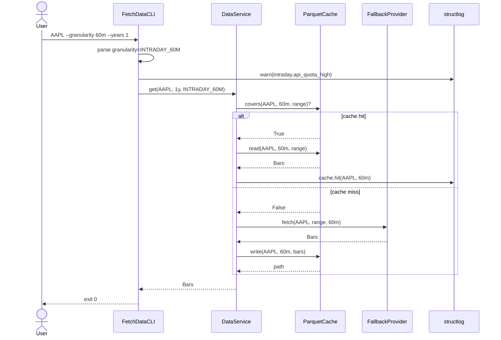

# UML: Slice 1.3 - Intraday-Support

Status:    DRAFT
Phase:     P1 Datenlayer
Slice:     1.3 Intraday
Approved:  -

Mapped Requirements:
- NFR-Perf-2: Daten-Fetch-Performance-Budget (Intraday warnt)
- NFR-Data-1: Parquet-Cache granuliert nach Granularitaet

Stories:
- US-P1.5: Intraday-Daten (Stunden oder Minuten) optional laden

Hinweis: Slice 1.3 erweitert Slice 1.2 nur um die Granularitaetsdimension. Structure/Components sind identisch, Flow/Sequence zeigen nur den Granularitaetszweig.

## Structure

## Flow

## Sequence

