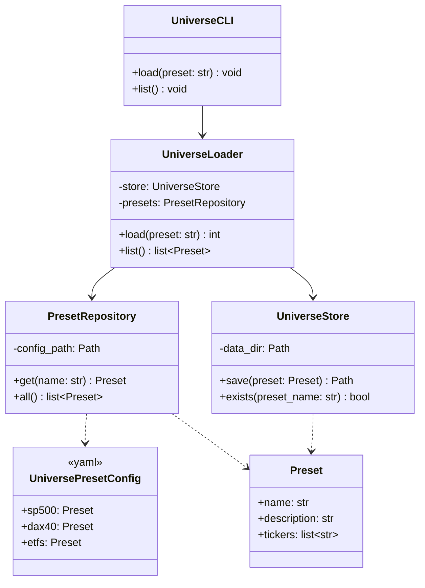
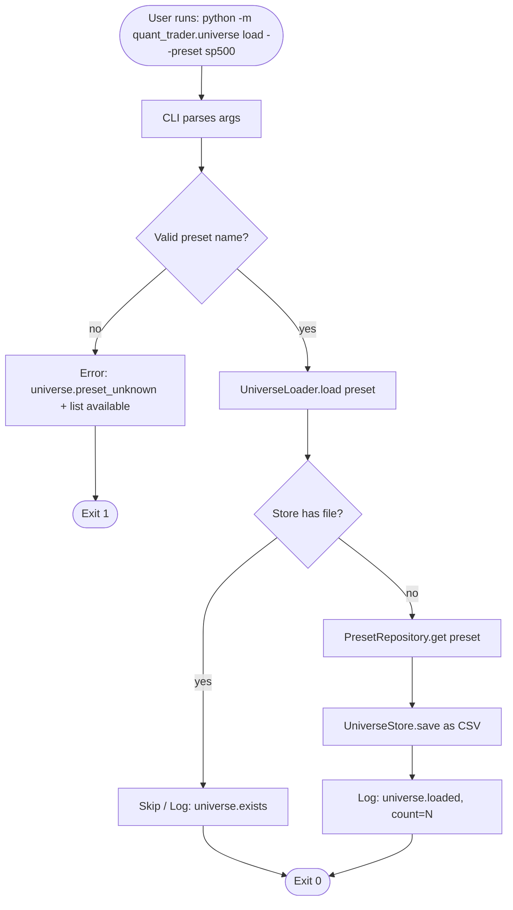
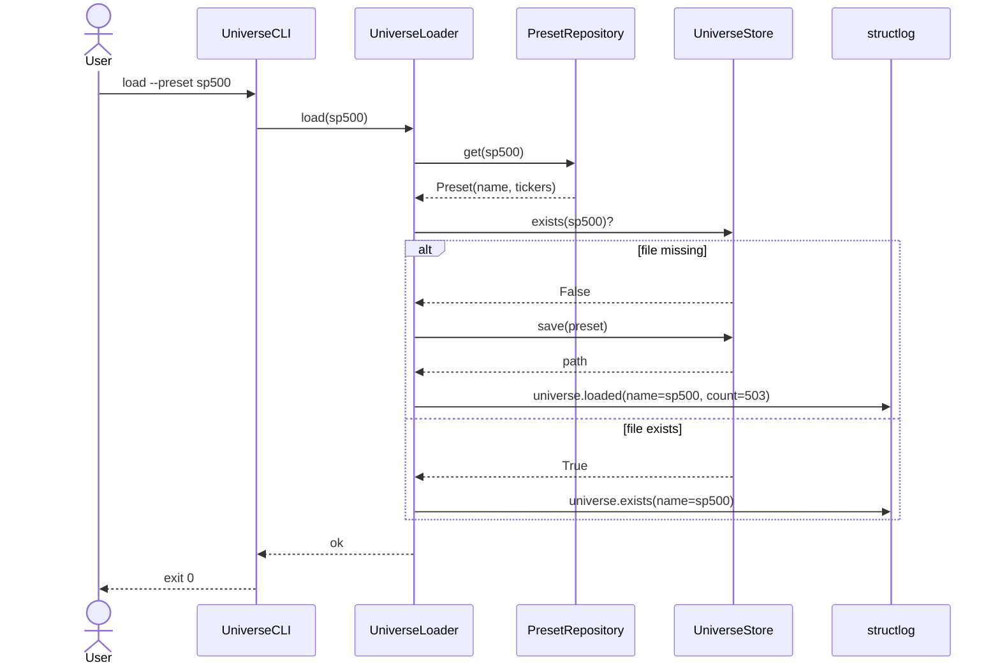

# UML: Slice 1.1 - Universe Loader

Status:    APPROVED
Phase:     P1 Datenlayer
Slice:     1.1 Universe Loader
Approved:  2026-07-08

Mapped Requirements:
- NFR-Sec-1: keine Secrets in Universe-Listen

Stories:
- US-P1.1: Standard-Listen importieren

## Structure

## Flow

## Sequence

