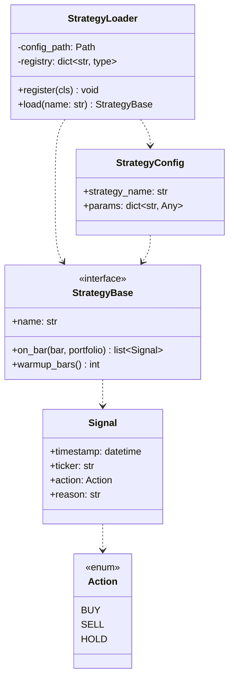
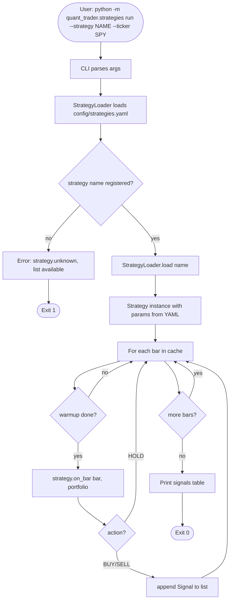
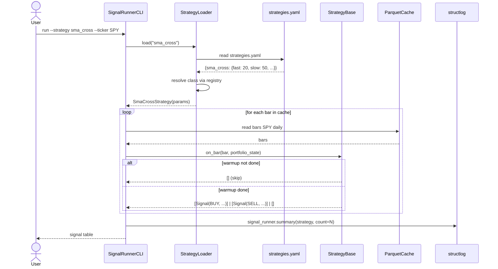

# UML: Slice 2.1 - Strategy Framework

Status:    DRAFT
Phase:     P2 Strategien
Slice:     2.1 Strategy Framework
Approved:  -

Mapped Requirements:
- NFR-Ux-1: klare API-Schnittstelle

Stories:
- US-P2.1: Einheitliche Strategy-Schnittstelle
- US-P2.2: Strategie-Parameter aus YAML

## Structure

## Flow

## Sequence

