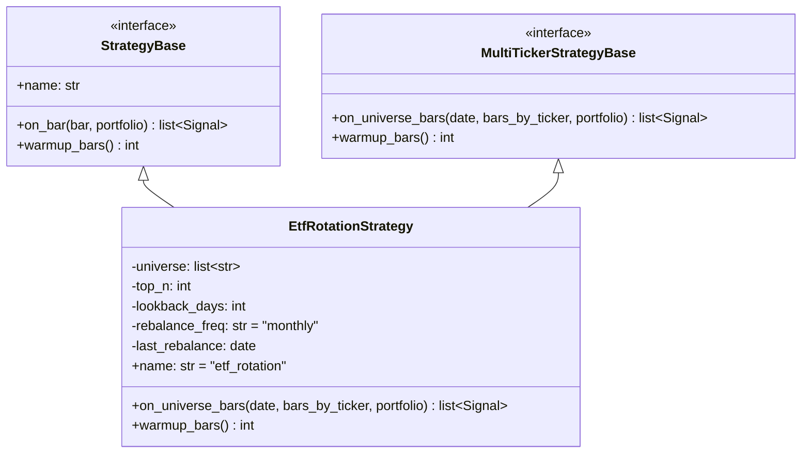
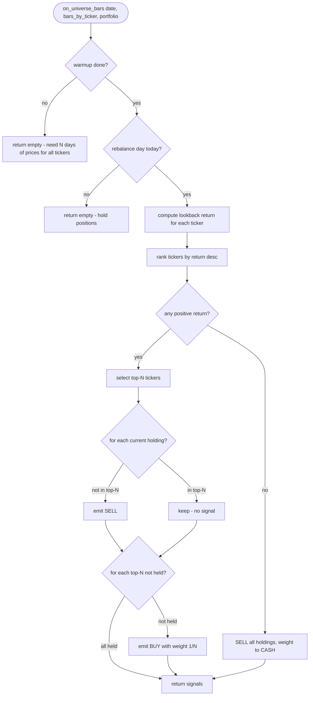
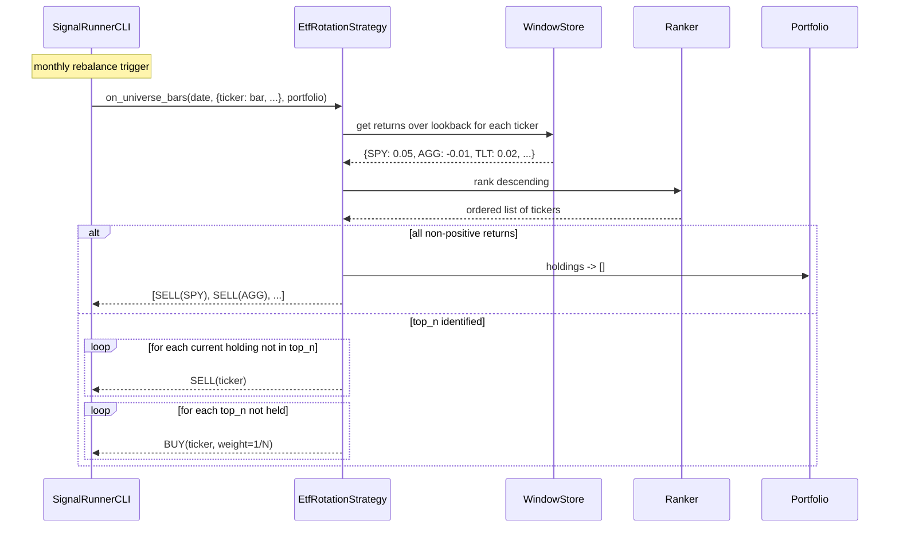

# UML: Slice 2.4 - ETF-Rotation (Top-N Momentum)

Status:    APPROVED
Phase:     P2 Strategien
Slice:     2.4 ETF-Rotation
Approved:  2026-07-10 (User)

Mapped Requirements:
- NFR-Perf-2: schnelle Berechnung (auch ueber mehrere ETFs)

Stories:
- US-P2.6: ETF Top-N Momentum Rotation

Hinweis: Diese Strategie arbeitet universe-basiert. on_bar bekommt einen Universe-Snapshot
(Ticker -> Bar), nicht einen einzelnen Bar. Daher erweitern wir StrategyBase optional um
eine zweite Methode `on_universe_bars(date, bars_by_ticker, portfolio)`.

## Structure

## Flow

## Sequence

