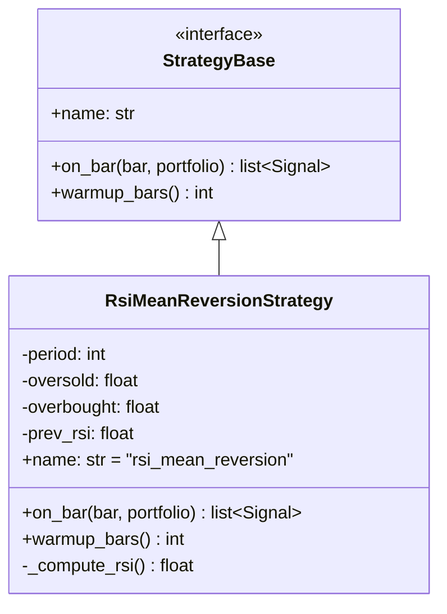
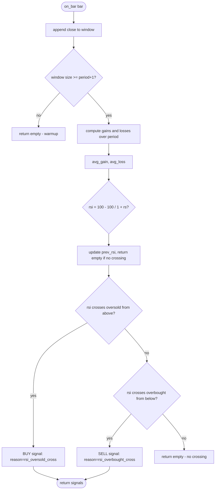
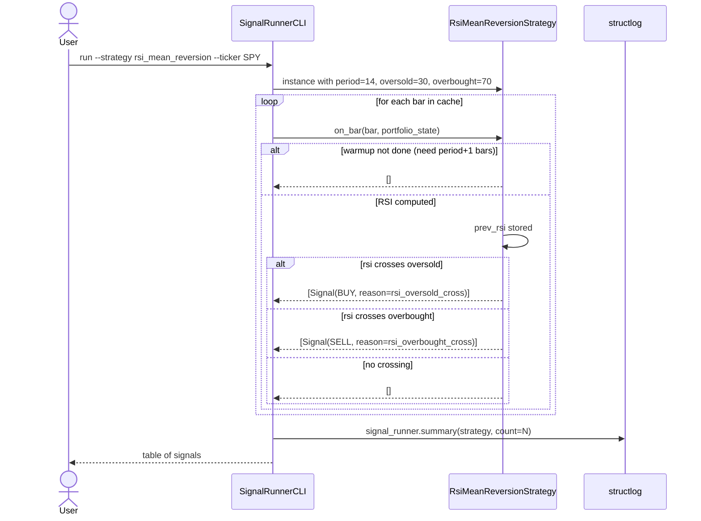

# UML: Slice 2.3 - Mean-Reversion (RSI)

Status:    DRAFT
Phase:     P2 Strategien
Slice:     2.3 Mean-Reversion (RSI)
Approved:  -

Mapped Requirements:
- NFR-Perf-2: schnelle Berechnung

Stories:
- US-P2.5: RSI Mean-Reversion

## Structure

## Flow

## Sequence

