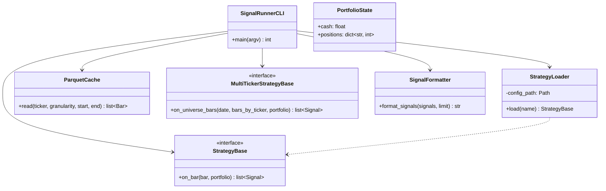
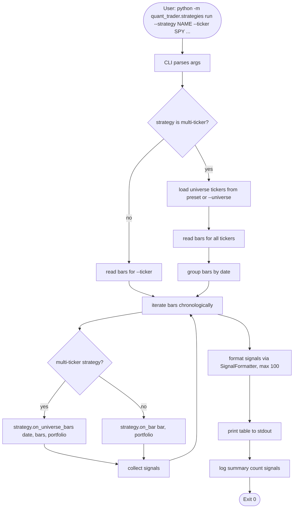
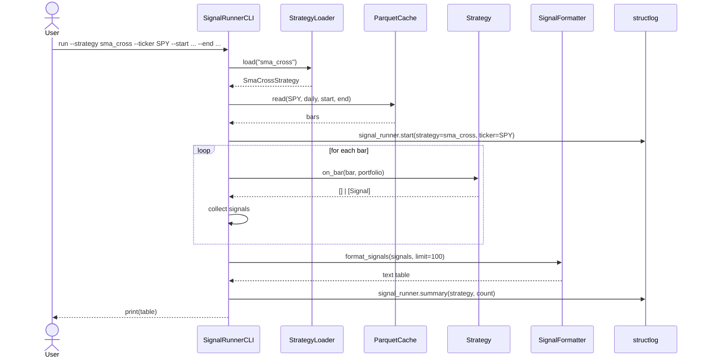

# UML: Slice 2.5 - Signal-Runner CLI

Status:    APPROVED
Phase:     P2 Strategien
Slice:     2.5 Signal-Runner
Approved:  2026-07-14

Mapped Requirements:
- NFR-Obs-1: Strukturierte Logs
- NFR-Data-1: Parquet-Cache nutzen

Stories:
- US-P2.7: Strategie-Signale ohne Backtest ausgeben

## Structure

## Flow

## Sequence

