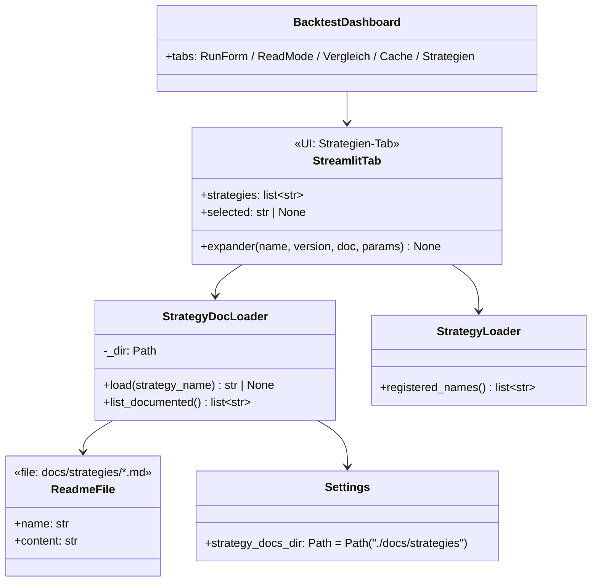
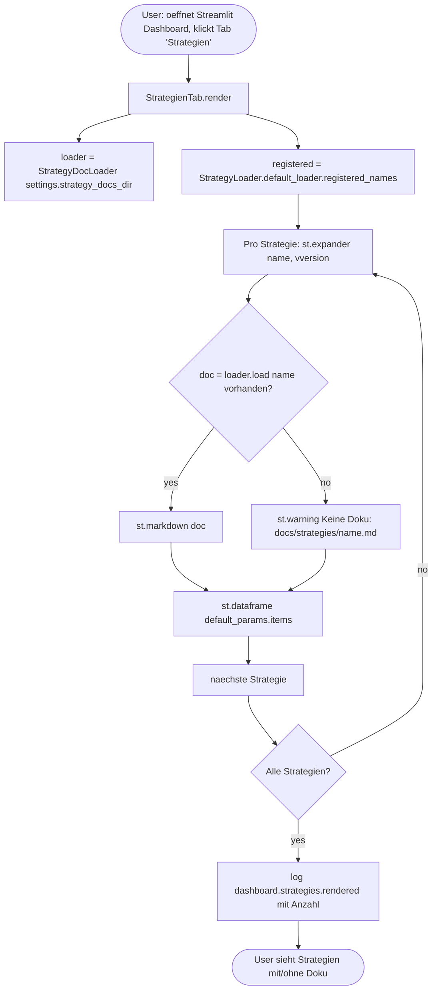
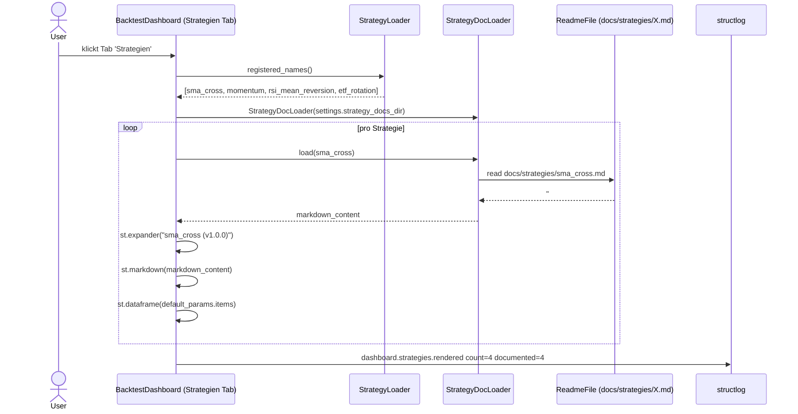

# UML: Slice 2.6 - Strategy Documentation Viewer

Status:    APPROVED
Phase:     P2 Strategien (Erweiterung)
Slice:     2.6 Strategy Documentation Viewer
Approved:  2026-07-15

Mapped Requirements:
- NFR-Ux-1: Deutsche UI-Texte + deutsche README-Inhalte
- NFR-Obs-1: Strukturiertes Logging (dashboard.strategies.rendered)

Stories:
- US-P2.8: Strategie-Doku im Dashboard abrufbar

Erweitert die registrierten Strategien um Markdown-READMEs und das
Streamlit-Dashboard um einen "Strategien"-Tab. Bestehende Klassen
`StrategyLoader`, `StrategyBase`, `SmaCrossStrategy` etc. werden
NICHT geaendert.

## Structure

## Flow

## Sequence

## Notes

- README-Files unter `docs/strategies/` (Convention: filename =
  `StrategyLoader.registered_names()`-Eintrag)
- Markdown mit Sections: Was?, Wann BUY/SELL?, Parameter, Risiken,
  Beispiel
- Deutsche Texte (NFR-Ux-1)
- Loader hat einfache Fallback-Logik: fehlende Datei -> None ->
  `st.warning` im Dashboard
- Default-Params aus `StrategyLoader._registry[name].default_params`
- Backward-Compat: keine Aenderung an Strategie-Klassen, 479 Tests
  unveraendert gruen
