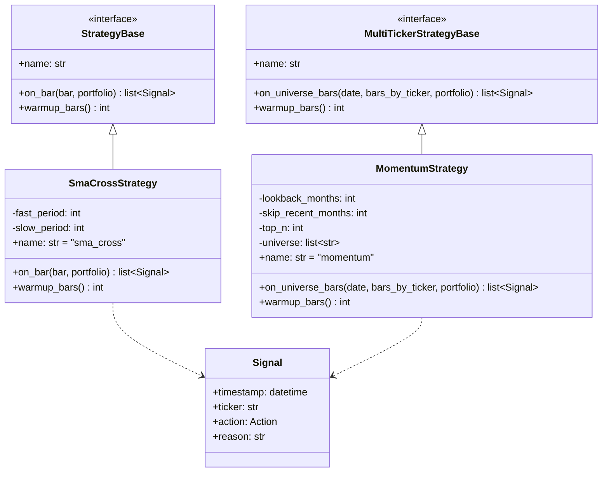
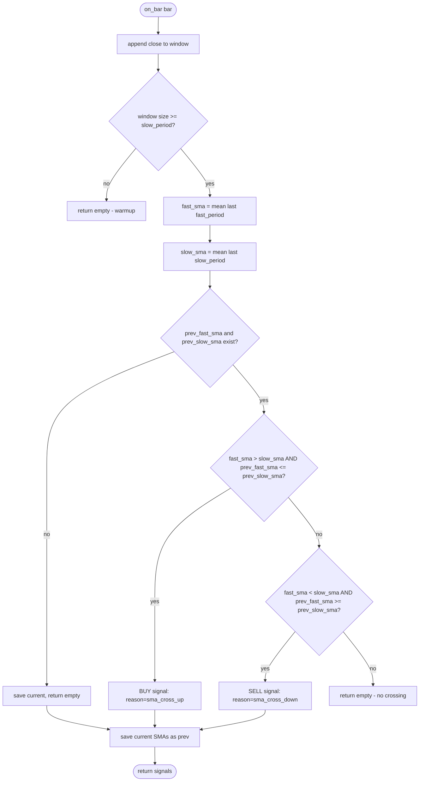
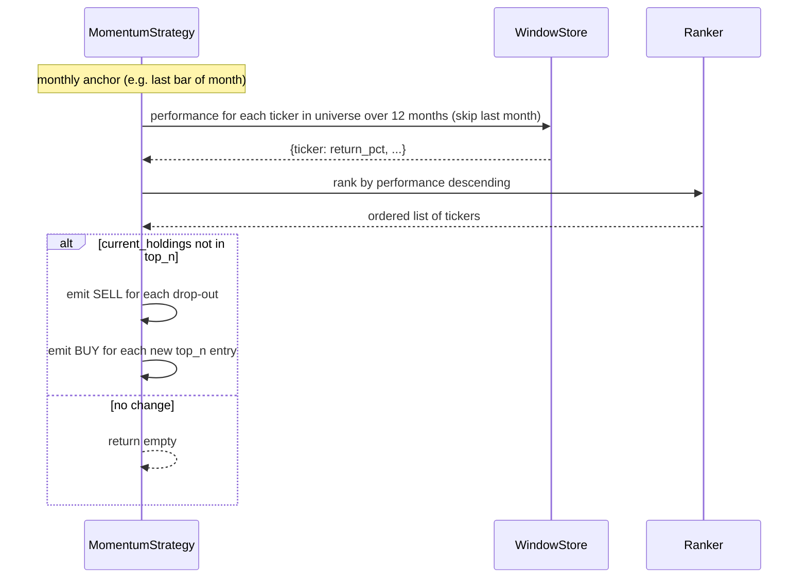

# UML: Slice 2.2 - Trend-Strategien (SMA-Cross + Momentum)

Status:    APPROVED
Phase:     P2 Strategien
Slice:     2.2 Trend-Strategien
Approved:  2026-07-10

Mapped Requirements:
- NFR-Perf-2: schnelle Berechnung

Stories:
- US-P2.3: SMA-Crossover
- US-P2.4: Momentum 12-1

Hinweis: zwei Strategien in einem Slice, gleiches Pattern. Structure zeigt beide als StrategyBase-Subklassen.

## Structure

## Flow (SMA-Cross)

## Sequence (Momentum 12-1)

Hinweis Momentum-Strategie arbeitet auf einem Universum von Bars, der SignalRunner
muss alle Ticker laden und reihen. Daher erbt `MomentumStrategy` von
`MultiTickerStrategyBase` (Slice 2.1) statt von `StrategyBase`; der Runner in
Slice 2.5 orchestriert den Aufruf von `on_universe_bars(date, bars_by_ticker, portfolio)`.