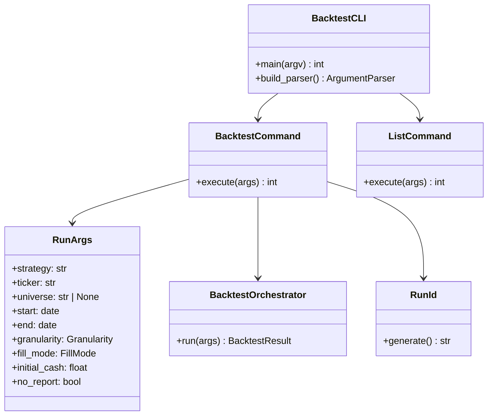
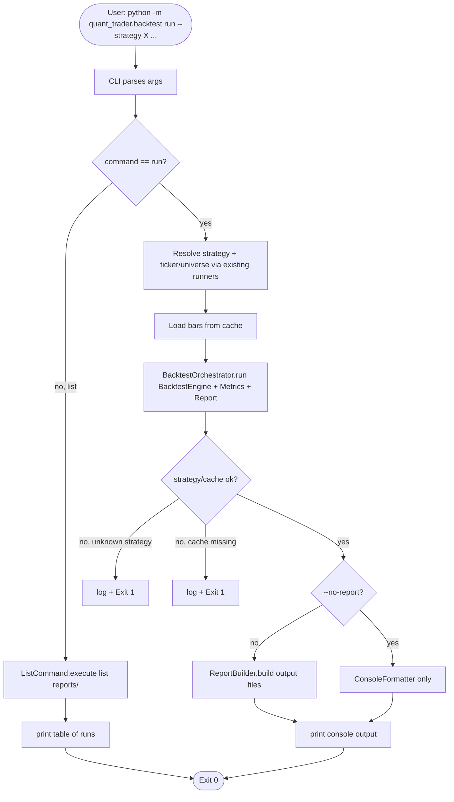
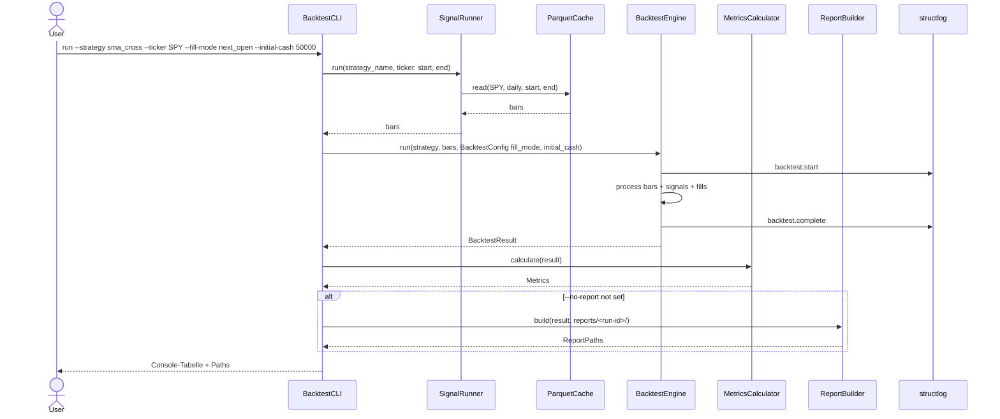

# UML: Slice 3.4 - Backtest CLI

Status:    APPROVED
Phase:     P3 Backtest
Slice:     3.4 CLI
Approved:  2026-07-14

Mapped Requirements:
- NFR-Ux-1: CLI-Texte deutsch
- NFR-Obs-1: Strukturiertes Logging

Stories:
- US-P3.8: Backtest ueber CLI starten

## Structure

## Flow

## Sequence

