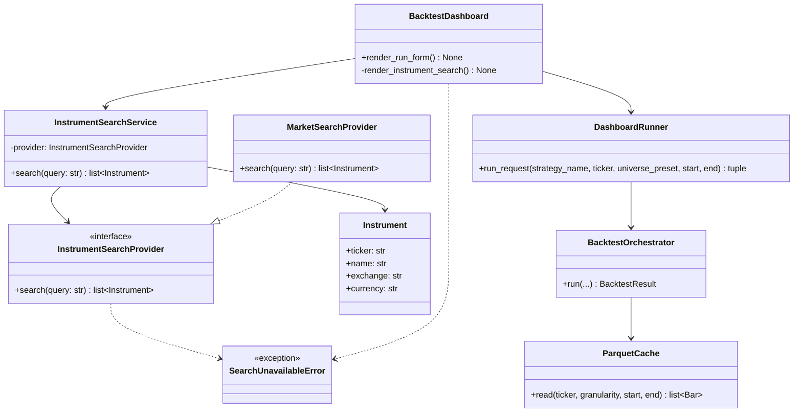
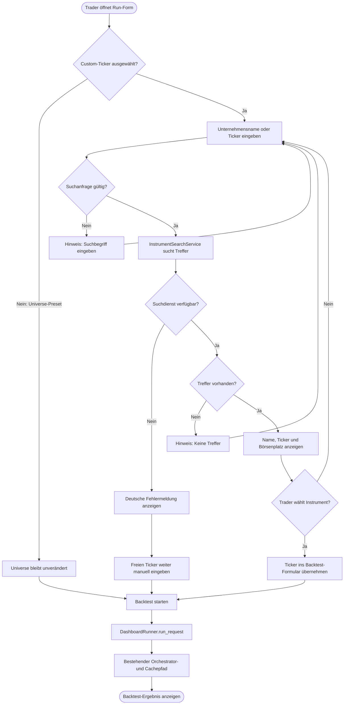
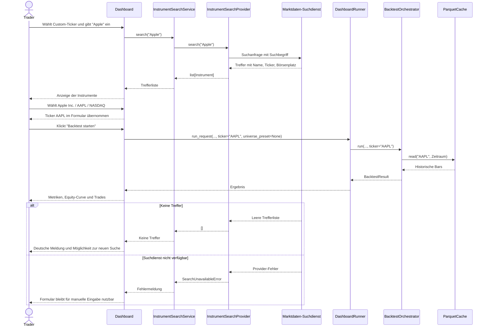

# UML: Slice 3.7 - Unternehmens- und Ticker-Suche im Dashboard

Status:    DRAFT
Phase:     P3 Backtest-Engine + Reports
Slice:     3.7 Unternehmens- und Ticker-Suche im Dashboard
Story:     US-P3.11 Unternehmen ohne bekannten Ticker finden

Mapped Requirements:
- NFR-Ux-1: Deutsche UI-Texte und klare, actionable Fehlermeldungen
- NFR-Data-1: Die gewählte Instrument-Auswahl verwendet weiterhin den bestehenden Daten- und Cachepfad
- NFR-Sec-1: Zugangsdaten für die Suchdatenquelle kommen ausschließlich aus der Umgebung

Die Suche ergänzt ausschließlich den Custom-Ticker-Teil des bestehenden Run-Forms.
Universe-Presets bleiben unverändert. Ein ausgewähltes Suchergebnis liefert nur den
Ticker an den bestehenden `DashboardRunner`; Backtest-Orchestrator und Cachepfad
werden nicht verändert.

## Structure

## Flow

## Sequence

