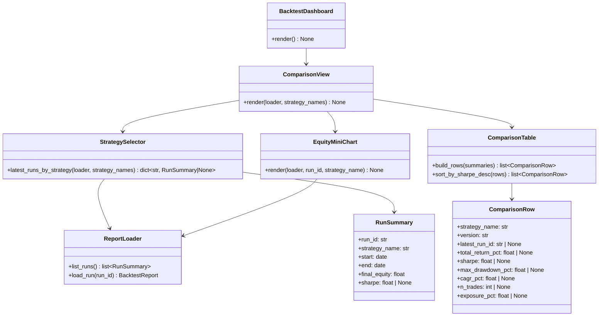
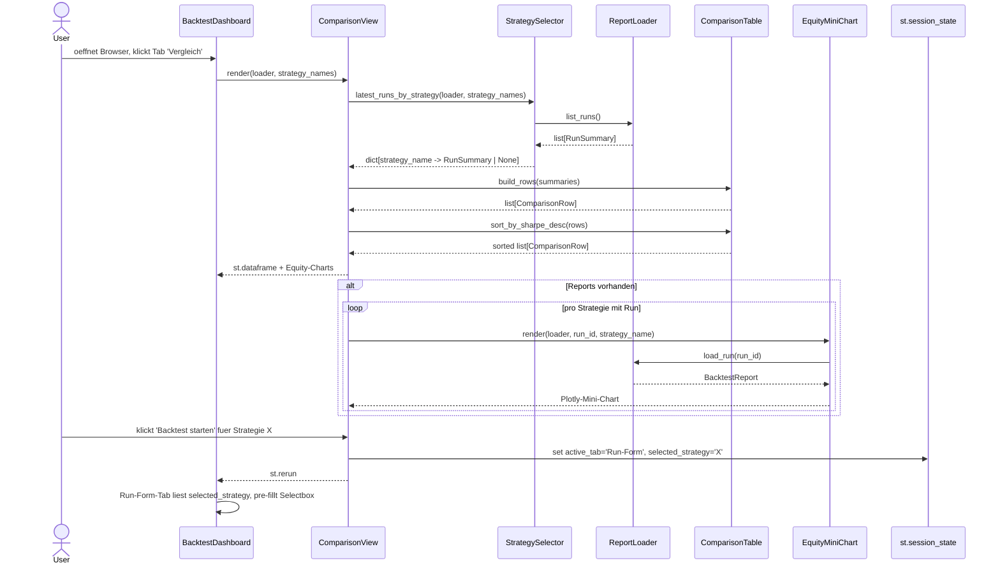

# UML: Slice 3.6 - Dashboard Strategie-Vergleichsansicht

Status:    APPROVED
Phase:     P3 Backtest
Slice:     3.6 Strategie-Vergleichsansicht
Approved:  2026-07-14

Mapped Requirements:
- NFR-Ux-1: Deutsche UI-Texte im Vergleichs-Tab

Stories:
- US-P3.10: Registrierte Strategien im Dashboard vergleichen

Erweitert das Streamlit-Dashboard (Slices 3.3 + 3.5) um einen dritten
Tab "Vergleich". Bestehende Klassen `BacktestDashboard`, `RunForm`,
`DashboardRunner`, `ReportLoader` werden wiederverwendet; neu ist die
`StrategySelector`-Logik und die `ComparisonView`-Komponente.

## Structure



## Flow

```mermaid
flowchart TD
    A([User: streamlit run scripts/backtest_dashboard.py]) --> B[BacktestDashboard.render]
    B --> C{st.tabs Run-Form / Read-Mode / Vergleich}
    C --> D[Tab 'Vergleich' aktiv]
    D --> E[StrategySelector.latest_runs_by_strategy loader, registered_names]
    E --> F[ReportLoader.list_runs reports/]
    F --> G[Gruppieren nach strategy_name, je neuester start]
    G --> H{dict: name -> RunSummary | None}
    H --> I{Strategien registriert?}
    I -->|no| J[st.info Keine Strategien registriert]
    I -->|yes| K[ComparisonTable.build_rows summaries]
    K --> L[ComparisonTable.sort_by_sharpe_desc rows]
    L --> M[st.dataframe mit Spalten Strategie/Version/letzter Run/Metriken]
    M --> N{Reports vorhanden?}
    N -->|no| O[st.info Noch keine Backtests gelaufen]
    N -->|yes| P[EquityMiniChart.render pro Strategie in st.columns 2]
    P --> Q[Pro Zeile Button Backtest starten -> st.session_state active_tab=Run-Form, selected_strategy]
    Q --> R([User kann in Run-Form-Tab wechseln mit vorausgewaehlter Strategie])
```

## Sequence


