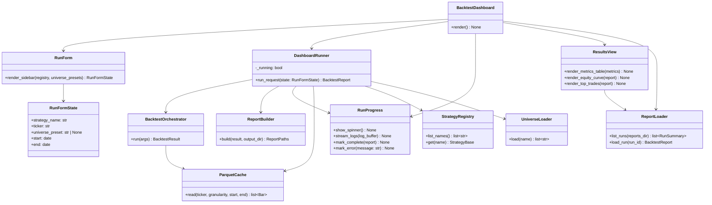
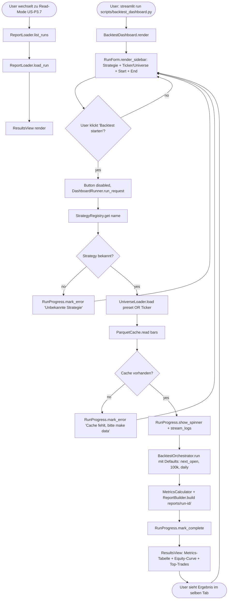
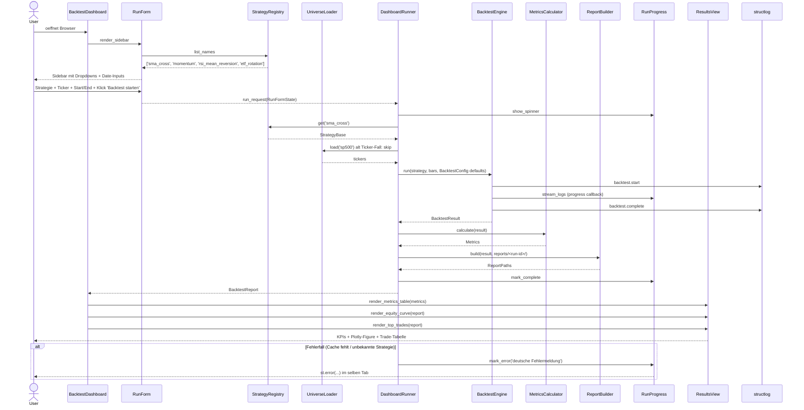

# UML: Slice 3.5 - Interaktives Backtest-Dashboard (Run-Trigger)

Status:    APPROVED
Phase:     P3 Backtest
Slice:     3.5 Interaktives Backtest-Dashboard
Approved:  2026-07-14

Mapped Requirements:
- NFR-Ux-1: UI-Texte deutsch, klare Fehlermeldungen
- NFR-Obs-1: Strukturiertes Logging waehrend des Runs
- NFR-Perf-1: <30s fuer 5y Daily (gilt fuer UI-getriggerte Runs)
- NFR-Data-1: Parquet-Cache wird ueber bestehende DataProvider genutzt

Stories:
- US-P3.9: Backtest aus dem Dashboard starten

Erweitert Slice 3.3 (Streamlit-Dashboard) um einen Run-Trigger.
Bestehende Klassen `BacktestDashboard`, `ReportLoader`, `EquityPlot`,
`DrawdownIndicator` aus `docs/uml/p3-backtest/report.md` werden wiederverwendet.

## Structure

## Flow

## Sequence

