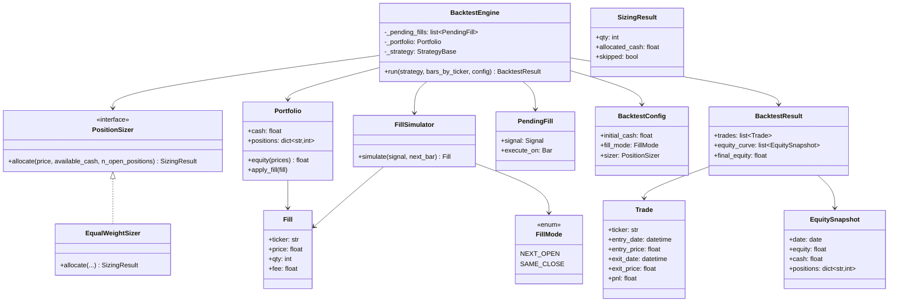
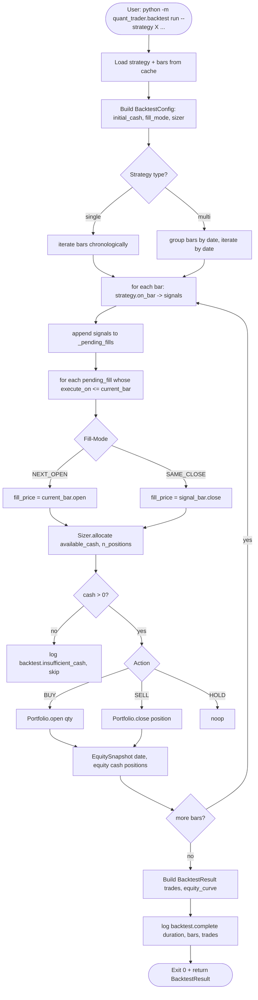
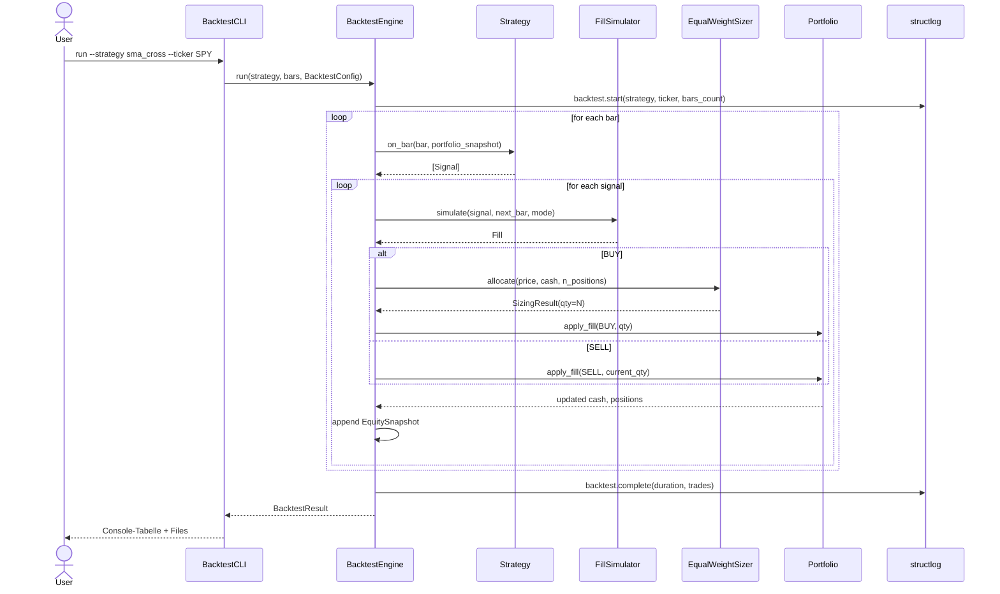
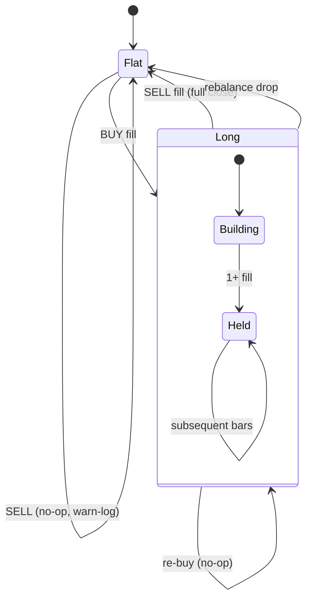

# UML: Slice 3.1 - Backtest Engine Core

Status:    DRAFT
Phase:     P3 Backtest
Slice:     3.1 Engine Core
Approved:  -

Mapped Requirements:
- NFR-Perf-1: 5 Jahre Daily < 30s
- NFR-Obs-1: Strukturiertes Logging
- NFR-Data-1: Parquet-Cache als Source

Stories:
- US-P3.1: Strategie auf historische Daten backtesten
- US-P3.2: Equal-Weight Position-Sizing

## Structure

## Flow

## Sequence

## State Machine: Position

## UML-Notes

- `Portfolio` ist immutable snapshot per Bar (frozen dataclass mit `positions: dict[str, int]`).
- `PendingFill` ermoeglicht NEXT_OPEN-Modus ohne Look-Ahead.
- `PositionSizer` ist Interface; Slice 3.1 implementiert nur `EqualWeightSizer`.
- `BacktestResult` ist Input fuer Slice 3.2 (Metrics) und 3.3 (Report).