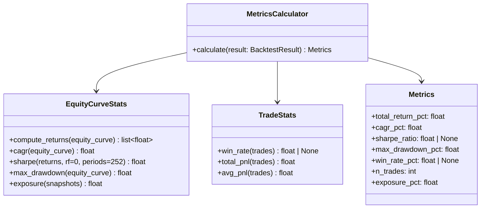
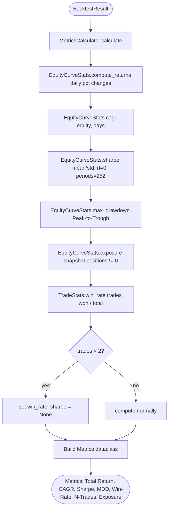
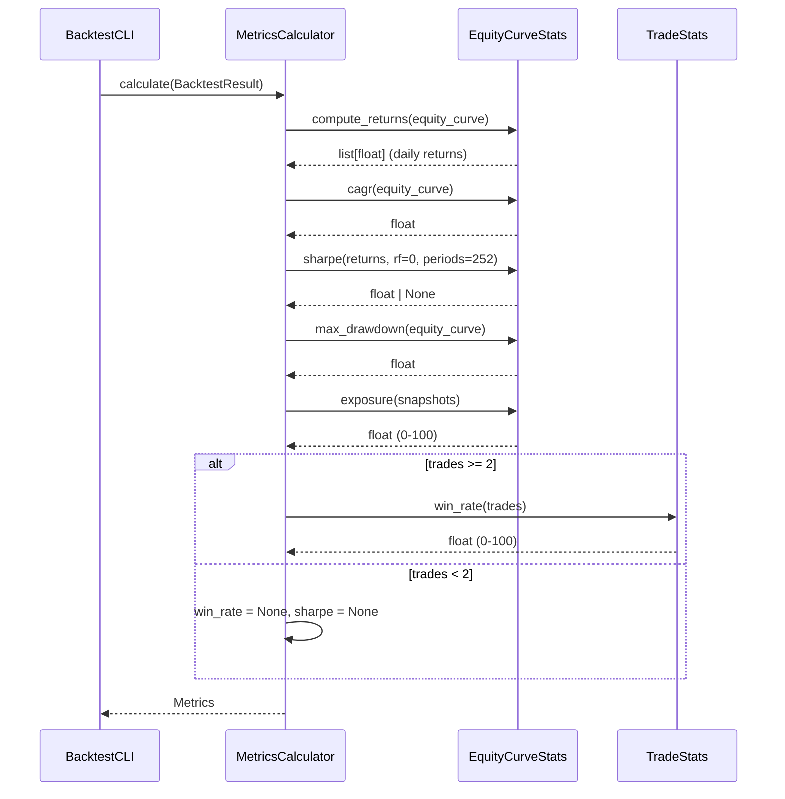

# UML: Slice 3.2 - Metrics

Status:    DRAFT
Phase:     P3 Backtest
Slice:     3.2 Metrics
Approved:  -

Mapped Requirements:
- NFR-Perf-1: schnelle Berechnung (<30s fuer 5 Jahre Daily)
- NFR-Data-2: Adj. Close fuer Rueckrechnungen

Stories:
- US-P3.3: Backtest-Metriken berechnen

## Structure

## Flow

## Sequence

