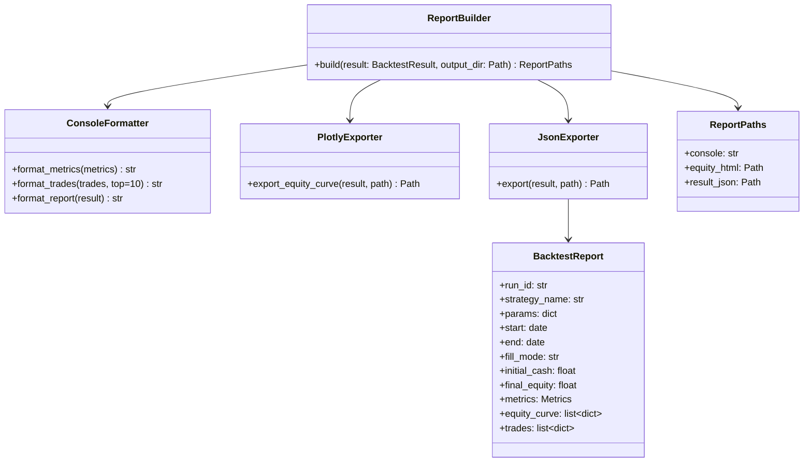
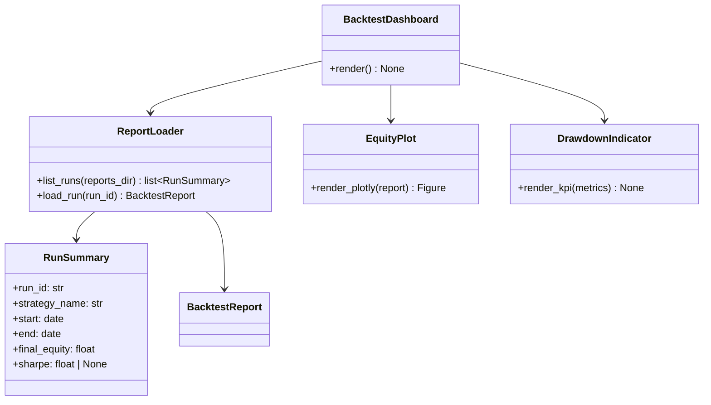
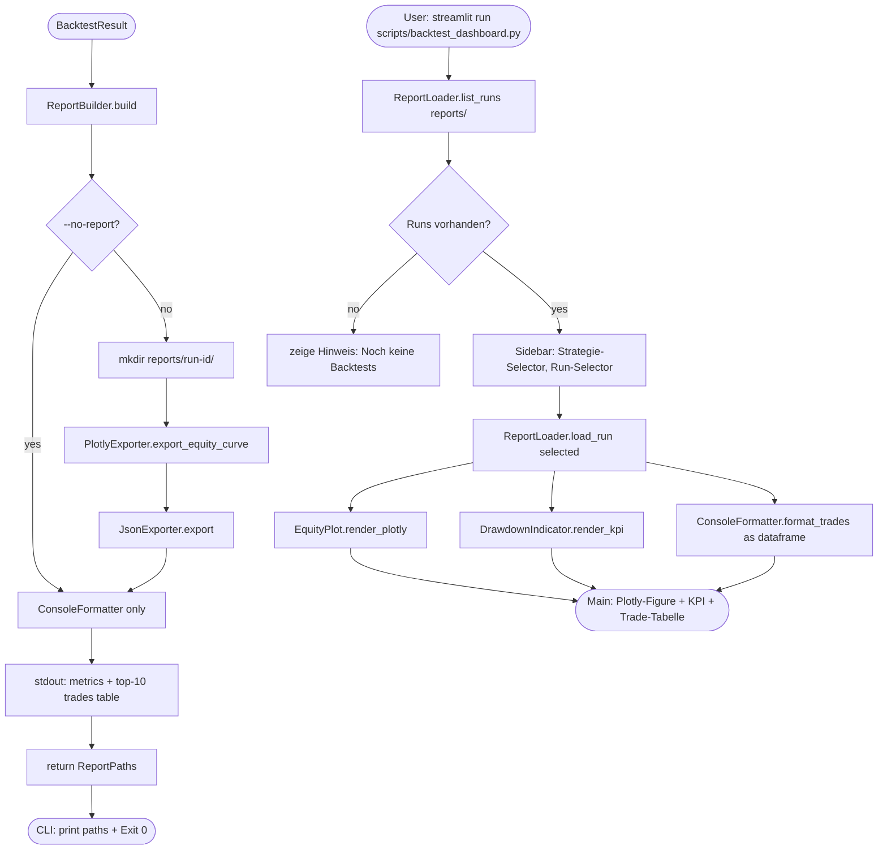
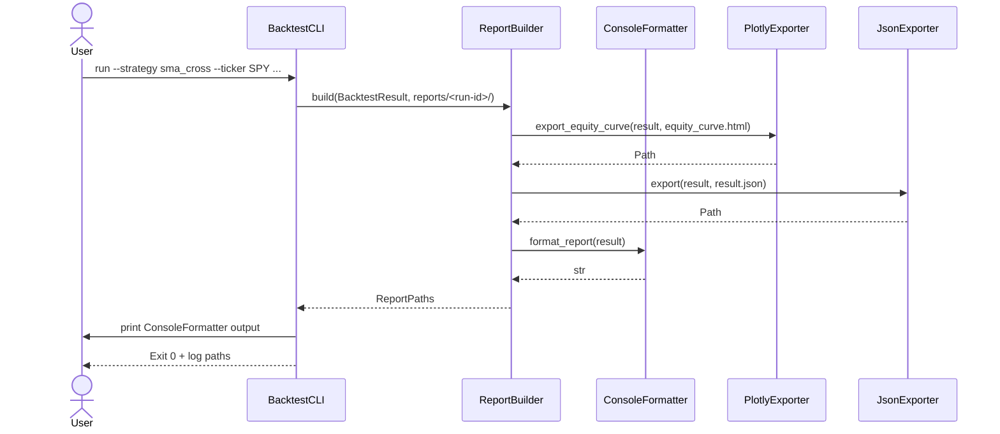

# UML: Slice 3.3 - Report (Console + Plotly + JSON + Streamlit)

Status:    APPROVED
Phase:     P3 Backtest
Slice:     3.3 Report
Approved:  2026-07-14

Mapped Requirements:
- NFR-Ux-1: CLI-Texte deutsch, klar
- NFR-Data-2: Adj. Close fuer Equity

Stories:
- US-P3.4: Backtest-Ergebnisse als Console-Tabelle
- US-P3.5: Equity-Curve als interaktives Plotly-HTML
- US-P3.6: Backtest als JSON exportieren
- US-P3.7: Streamlit-Dashboard fuer Backtest-Vergleich

## Structure

## Streamlit-Dashboard (Sub-Slice)

## Flow

## Sequence

