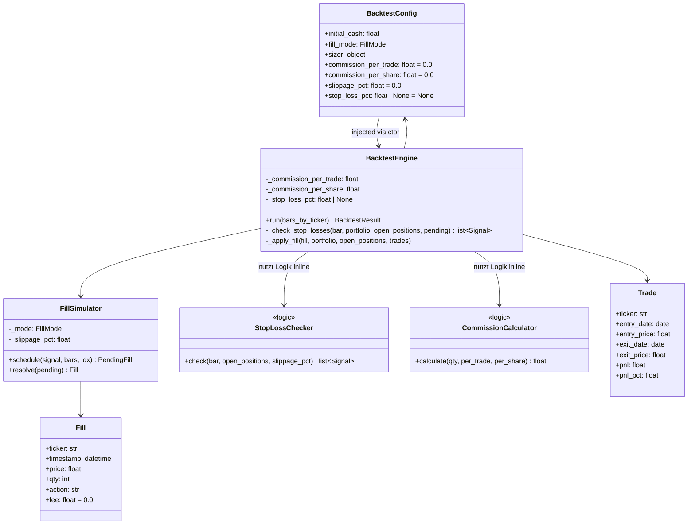
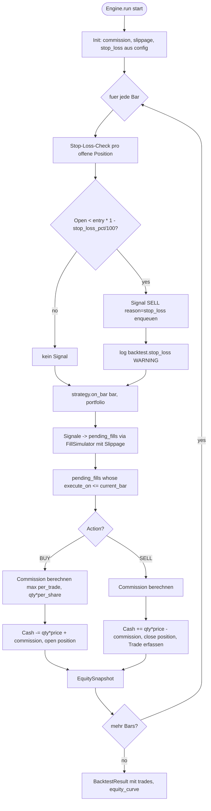
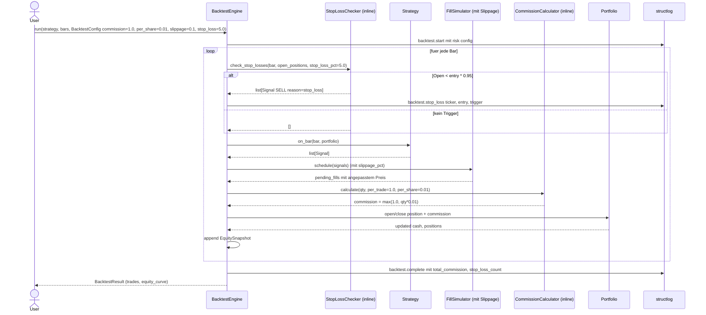

# UML: Slice 4.1 - Risk-Engine (Commission + Slippage + Stop-Loss)

Status:    APPROVED
Phase:     P4 Risk Management
Slice:     4.1 Risk-Engine
Approved:  2026-07-14

Mapped Requirements:
- NFR-Perf-1: Backtest <30s (minimal Overhead)
- NFR-Data-2: Adj. Close (nicht direkt betroffen, aber via Engine-Pipeline)
- NFR-Ux-1: klare Logs (backtest.stop_loss WARNING)

Stories:
- US-P4.1: Commission pro Trade (IBKR-Stil)
- US-P4.2: Slippage pro Trade
- US-P4.3: Stop-Loss pro Position

Erweitert die bestehende BacktestEngine (Slice 3.1) um Cost- und
Risk-Komponenten. Bestehende Klassen `BacktestEngine`, `FillSimulator`,
`BacktestConfig` werden modifiziert; `Portfolio`, `Trade`,
`EquitySnapshot` bleiben unveraendert.

## Structure

## Flow

## Sequence

## Notes

- **Backward-Compat**: `commission_per_trade=0.0`, `commission_per_share=0.0`,
  `slippage_pct=0.0`, `stop_loss_pct=None` (Defaults) ergeben identisches
  Verhalten zu Slice 3.1.
- **Stop-Loss-Timing**: Check **vor** `strategy.on_bar`; so verhindert
  der Stop-Loss, dass die Strategie an einem Tag neue Signale generiert,
  an dem die Position bereits geschlossen wurde.
- **Stop-Loss-Trigger**: nur Long-Positionen (Phase 4 hat kein Short).
- **Slippage-Anwendung**: in `FillSimulator.resolve()`, symmetrisch
  fuer BUY (+) und SELL (-).
- **Commission-Buchung**: in `BacktestEngine._apply_fill()`, sowohl
  Entry als auch Exit, `Fill.fee` traegt Commission pro Fill.
- **Trade.pnl**: inkludiert Entry- und Exit-Commission automatisch
  (durch Cash-Buchung in `_apply_fill`).
- **Logging**: `backtest.stop_loss` WARNING mit Ticker, Entry-Price,
  Trigger-Price fuer jedes getriggerte Stop-Loss-Event.
