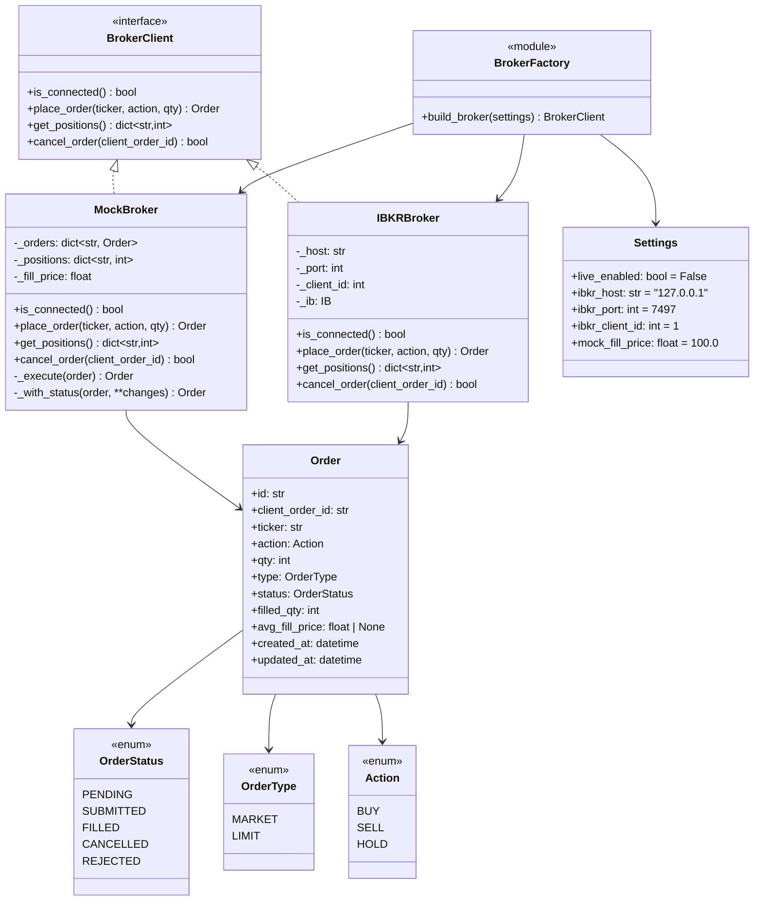
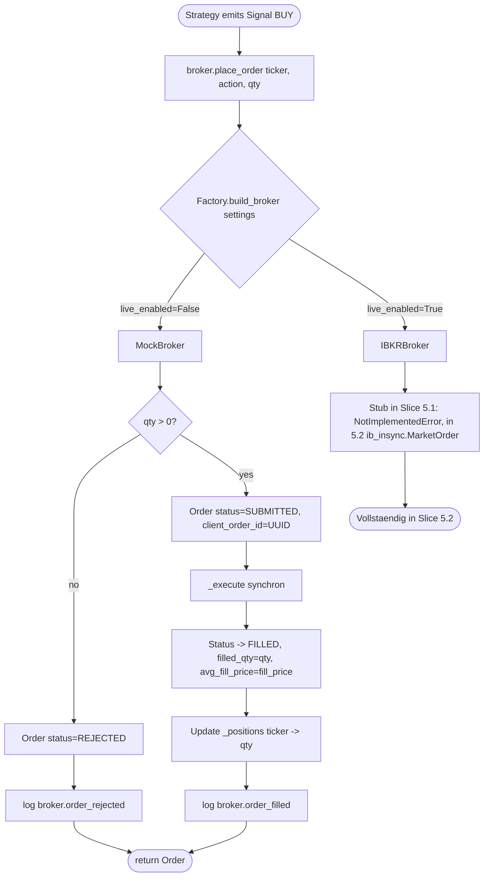
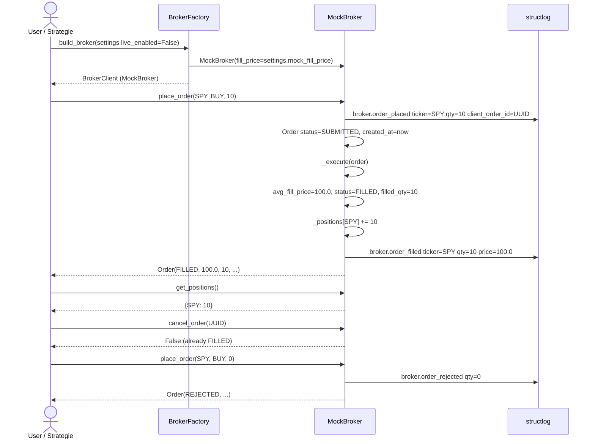

# UML: Slice 5.1 - Broker Interface + Mock + Order

Status:    APPROVED
Phase:     P5 Live-Trading
Slice:     5.1 Broker Interface + Mock + Order
Approved:  2026-07-14

Mapped Requirements:
- NFR-Rel-3: Order-Manager idempotent (UUID client_order_id)
- NFR-Sec-2: Credentials via TWS only (out-of-scope fuer 5.1, kommt in 5.5)
- NFR-Obs-1: Strukturiertes Logging (broker.order_placed, broker.order_filled, broker.order_rejected)

Stories:
- US-P5.1: Strategie sendet Market-Order ueber Broker-Abstraktion

Schafft die Foundation fuer Phase 5: ein einheitliches `BrokerClient`
Protocol, das sowohl `MockBroker` (CI, deterministisch) als auch
`IBKRBroker` (real, slice 5.2) implementiert. `Order` und
`OrderStatus` sind die geteilte Sprache.

## Structure

## Flow

## Sequence

## Notes

- `Order` ist frozen; Status-Updates erzeugen neue Instanzen
  (`_with_status(order, status=FILLED, ...)` Helper in `MockBroker`).
- `client_order_id` ist UUID (Idempotenz, NFR-Rel-3).
- `IBKRBroker` ist in Slice 5.1 ein Stub mit `NotImplementedError` und
  Slice-5.2-Hinweis; echte `ib_insync`-Logik kommt in 5.2.
- `MockBroker` ist deterministisch: `fill_price` aus Settings, kein
  Random, kein Time-Sleep, kein Network -> CI ohne `live` extra.
- `ib_insync`-Import nur in `ibkr.py` mit `try/except ImportError ->
  SystemExit`. So funktioniert CI ohne `live` extra.
- `OrderType.LIMIT` ist im Enum, wird aber in P5 nicht genutzt
  (nur MARKET). Erweiterung in spaeterer Phase.
