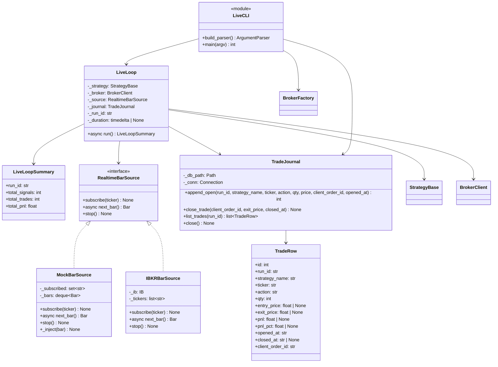
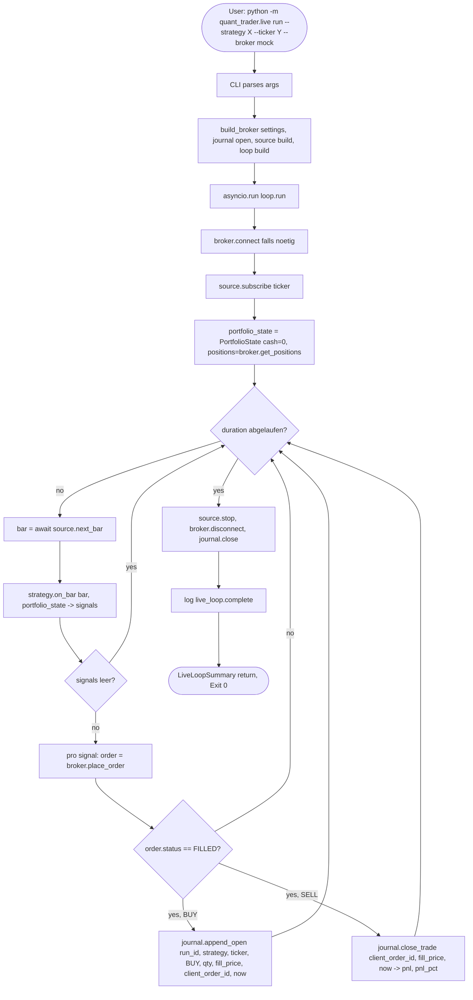
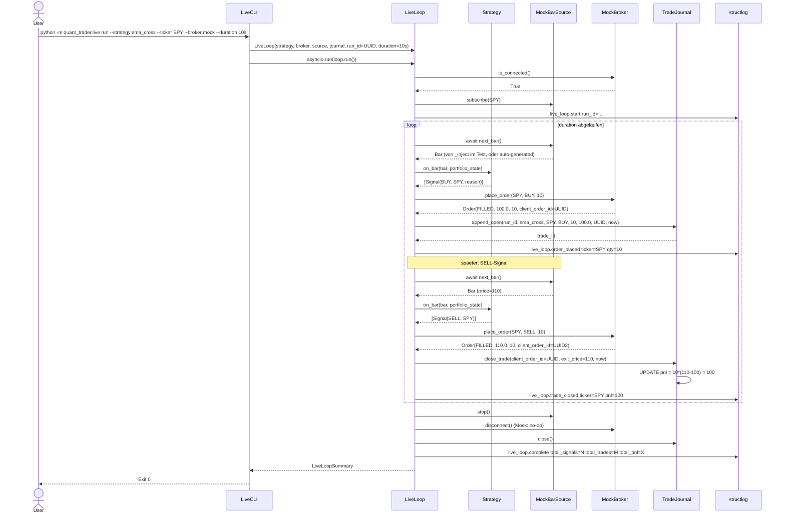

# UML: Slice 5.2 - Live-Loop (Realtime-Bars + Order-Placement + Trade-Journal)

Status:    APPROVED
Phase:     P5 Live-Trading
Slice:     5.2 Live-Loop + Trade-Journal + Live-CLI
Approved:  2026-07-14

Mapped Requirements:
- NFR-Rel-1: Daten-Fetch idempotent (client_order_id UNIQUE-Constraint)
- NFR-Rel-3: Order-Manager idempotent (UNIQUE-Constraint in SQLite)
- NFR-Obs-1: Strukturiertes Logging (live_loop.* Events)
- NFR-Ux-1: Deutsche CLI-Texte

Stories:
- US-P5.2: Live-Loop: Strategie empfaengt Realtime-Bars und sendet Orders

Erweitert `live/` aus Slice 5.1 um den eigentlichen Live-Loop,
ein SQLite-Trade-Journal, einen Realtime-Bar-Source und eine
`python -m quant_trader.live` CLI.

## Structure

## Flow

## Sequence

## Notes

- `client_order_id` UNIQUE-Constraint in SQLite garantiert Idempotenz
  (NFR-Rel-1, NFR-Rel-3) ohne Retry-Logik
- `MockBarSource._inject(bar)` ermoeglicht deterministische Tests ohne
  sleep oder random
- `IBKRBarSource` nutzt `ib_insync.IB.reqRealTimeBars()` mit 5s
  Bar-Intervall (IBKR-Limit); Polling via `ib.sleep(0)` in asyncio
  Event-Loop
- `LiveLoop.run` ist `async`; CLI ruft via `asyncio.run()`
- Bei `IBKRBroker.place_order`: nutzt `MarketOrder(action, qty)`,
  ruft `ib.placeOrder()`, wartet auf Fill via
  `ib_insync OrderState.Filled` callback (in 5.2: einfaches
  `ib.sleep(0.1)` Poll)
- `journal.append_open` kann `sqlite3.IntegrityError` werfen bei
  doppelter `client_order_id`; Loop faengt ab, loggt
  `live_loop.duplicate_order_skipped` und faehrt fort
- Backward-Compat: alle 394 bestehenden Tests unveraendert gruen
