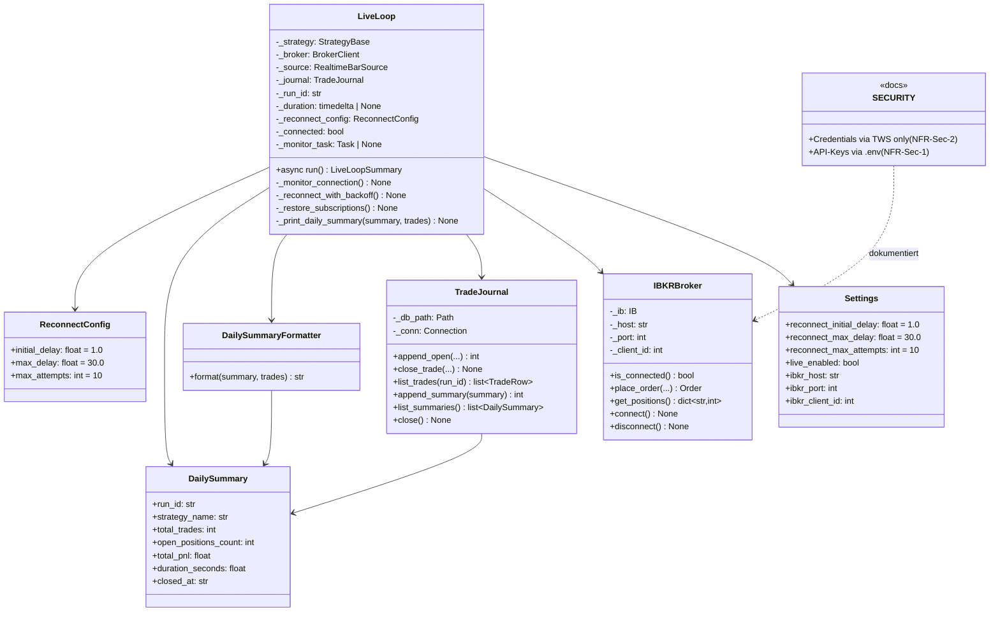
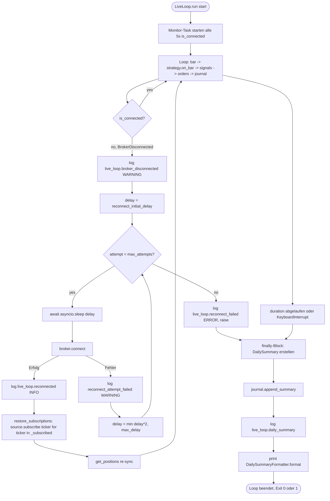
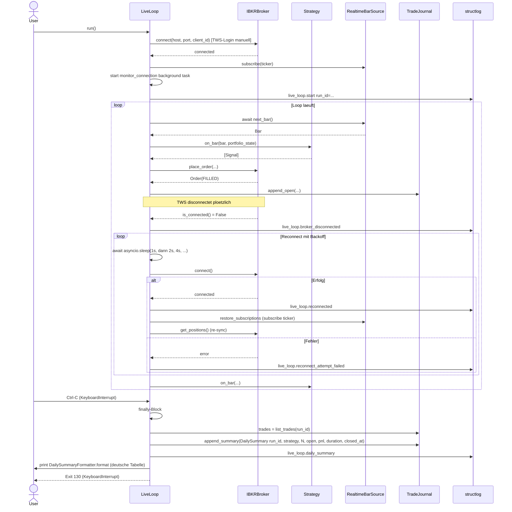

# UML: Slice 5.3 - Live-Loop Resilience (Auto-Reconnect + Summary + Credentials)

Status:    APPROVED
Phase:     P5 Live-Trading
Slice:     5.3 Auto-Reconnect + Tageszusammenfassung + Credentials
Approved:  2026-07-14

Mapped Requirements:
- NFR-Rel-2: Live-Loop uebersteht TWS-Disconnect mit Auto-Reconnect
- NFR-Obs-2: Tageszusammenfassung als Log oder Report
- NFR-Sec-2: Broker-Credentials nur via IBKR TWS, kein persistenter Save
- NFR-Obs-1: Strukturiertes Logging (reconnect/summary Events)
- NFR-Ux-1: Deutsche Summary-Tabelle

Stories:
- US-P5.3: Live-Loop uebersteht TWS-Disconnect mit Auto-Reconnect
- US-P5.4: Tageszusammenfassung beim Beenden des Live-Loops
- US-P5.5: Broker-Credentials via TWS ohne Persistenz

Erweitert Slice 5.2 (Live-Loop + Journal + CLI) um Robustheits- und
Compliance-Features. `IBKRBroker` bleibt Stub fuer TWS-Connect,
wird aber fuer Auto-Reconnect-Tauglichkeit vorbereitet.

## Structure

## Flow

## Sequence

## Notes

- **Auto-Reconnect nur fuer IBKRBroker**: `MockBroker.is_connected()`
  returnt immer True, daher kein Reconnect noetig
- **Exponential-Backoff**: `1s -> 2s -> 4s -> 8s -> 16s -> 30s` (cap),
  max 10 Attempts
- **Subscription-Recovery**: `MockBarSource._subscribed` (set) +
  `IBKRBarSource._tickers` (list) werden bei Reconnect re-subscribed
- **DailySummary in `finally`-Block**: wird auch bei KeyboardInterrupt
  und Reconnect-Failure geschrieben
- **Credentials via TWS**: `IBKRBroker.connect()` ruft `ib.connect()`
  ohne Credentials-Argumente; TWS-Login-Prompt manuell am TWS
- **SECURITY.md**: zentrale Doku der Credentials-Policy (NFR-Sec-1 +
  NFR-Sec-2)
- **Backward-Compat**: alle 417 bestehenden Tests unveraendert gruen
  (Defaults der neuen Reconnect-Config = sinnvolle Werte, MockBroker
  uebergeht Reconnect-Path)
