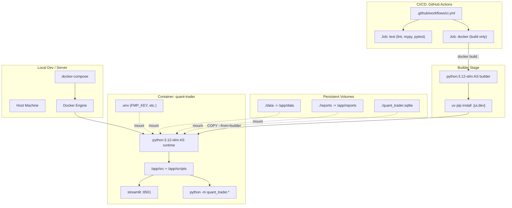
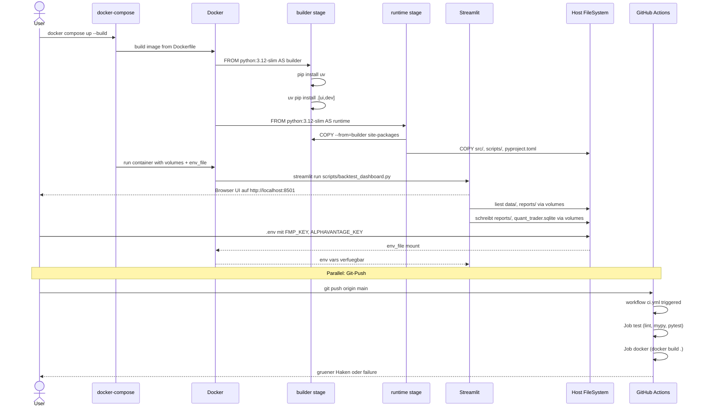

# UML: Slice 7.1 - Docker-Deployment + CI/CD

Status:    APPROVED
Phase:     P7 Docker-Deployment
Slice:     7.1 Docker-Deployment
Approved:  2026-07-14

Mapped Requirements:
- NFR-Ops-1: Lokale Entwicklung + spaeteres Docker-Deployment (DRAFT -> APPROVED)
- NFR-Sec-1: API-Keys via .env, niemals im Repo/Image
- NFR-Obs-1: CI-Logs strukturiert via GitHub Actions

Stories:
- US-P7.1: QuantTrader laeuft in Docker mit CI-Build

Erstellt die Deployment-Pipeline: Multi-Stage-Dockerfile, docker-compose
mit persistenten Volumes, GitHub-Actions-CI fuer automatische
Verifikation. KEIN Auto-Push zu Registry (manuelles `docker build`
reicht fuer persoenlichen Use-Case).

## Structure



## Flow

```mermaid
flowchart TD
    A([User: docker compose up --build]) --> B[docker-compose liest yml]
    B --> C[Build-Phase: Stage 1 builder]
    C --> D[uv pip install .[ui,dev]]
    D --> E[Stage 2 runtime]
    E --> F[COPY --from=builder site-packages]
    F --> G[COPY src/ scripts/]
    G --> H[Container startet]
    H --> I[entrypoint.sh liest CMD]
    I --> J{CMD = streamlit?}
    J -->|yes| K[streamlit run scripts/backtest_dashboard.py --server.address 0.0.0.0]
    J -->|no, CLI-Args| L[exec python -m quant_trader.X ...]
    K --> M[Port 8501 exposed]
    M --> N[Browser: http://localhost:8501]
    L --> O[CLI-Output auf stdout]

    P([Git push to main]) --> Q[GitHub Actions Trigger]
    Q --> R[Job: test]
    R --> S[uv sync --all-extras]
    S --> T[ruff check + format check + mypy]
    T --> U[pytest not live not slow]
    U --> V{alle gruen?}
    V -->|no| W[CI fail, PR blockiert]
    V -->|yes| X[Job: docker]
    X --> Y[docker build .]
    Y --> Z{Build OK?}
    Z -->|no| W
    Z -->|yes| AA[CI pass]
```

## Sequence



## Notes

- Image basiert auf `python:3.12-slim` (~150 MB Basis + ~100 MB
  Packages + Source ~ 300-400 MB total, < 500 MB Ziel)
- Multi-Stage-Build: Builder-Image hat `uv` + dev-Tools, Runtime nur
  Production-Deps
- Volumes: `./data`, `./reports`, `./quant_trader.sqlite` sind
  persistent auf dem Host, ueberleben Container-Restarts
- `env_file: .env` mounted die Secrets, Image enthaelt KEINE .env
- `stdin_open + tty` fuer interaktive CLI:
  `docker compose exec qtrader python -m quant_trader.backtest list`
- CI: GitHub Actions, kein Push zu Registry, nur Verifikation
- Backward-Compat: 434 bestehende Tests unveraendert gruen
- KEIN Production-Hardening: kein non-root user, kein healthcheck,
  kein resource limit (YAGNI fuer persoenlichen Use-Case)
